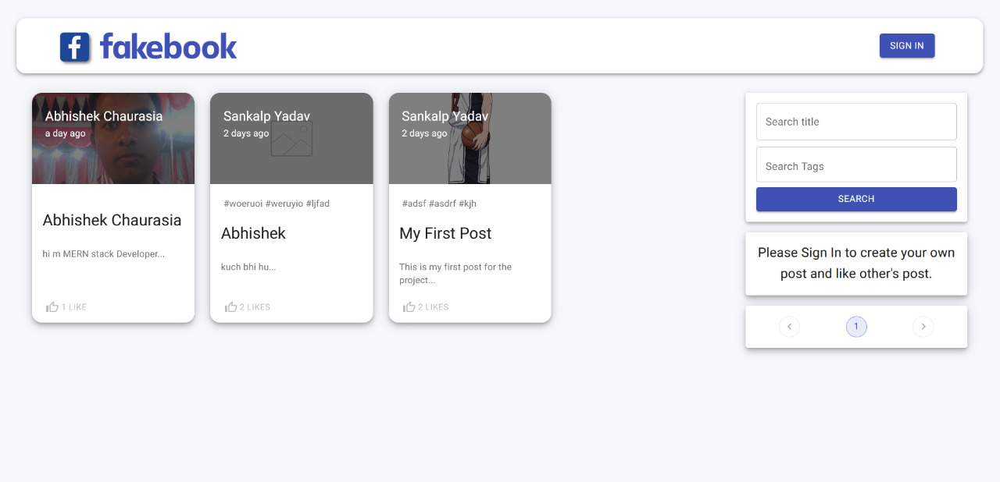

# Memories



 Used Library–
        "bcryptjs": "^2.4.3",
    "body-parser": "^1.19.0",
    "cors": "^2.8.5",
    "dotenv": "^10.0.0",
    "express": "^4.17.1",
    "jsonwebtoken": "^8.5.1",
    "mongoose": "^5.9.29",
"@material-ui/core": "^4.9.10",
    "@material-ui/icons": "^4.9.1",
    "@material-ui/lab": "^4.0.0-alpha.58",
    "@testing-library/jest-dom": "^4.2.4",
    "@testing-library/react": "^9.3.2",
    "@testing-library/user-event": "^7.1.2",
    "axios": "^0.19.2",
    "jwt-decode": "^3.1.2",
    "loadash": "^1.0.0",
    "material-ui-chip-input": "^1.1.0",
    "moment": "^2.27.0",
    "react": "^16.12.0",
    "react-dom": "^16.12.0",
    "react-file-base64": "^1.0.3",
    "react-google-login": "^5.1.25",
    "react-redux": "^7.1.3",
    "react-router-dom": "^5.2.0",
    "react-scripts": "3.4.1",
    "redux": "^4.0.5",
    "redux-thunk": "^2.3.0"
 
 Language Used–
        JavaScript


## Introduction

Using React, Node.js, Express & MongoDB we have build a Full Stack MERN Application. The App is called "FakeBook" and it is a simple social media app that allows users to post interesting events that happened in their lives.


Setup:
- run ```npm i && npm start``` for both client and server side to start the app

TODO: 
    rename post message, 
    refactor reducers, 
    add some cool Posts, 
    maybe clickable tags, 
    fix update functionality
